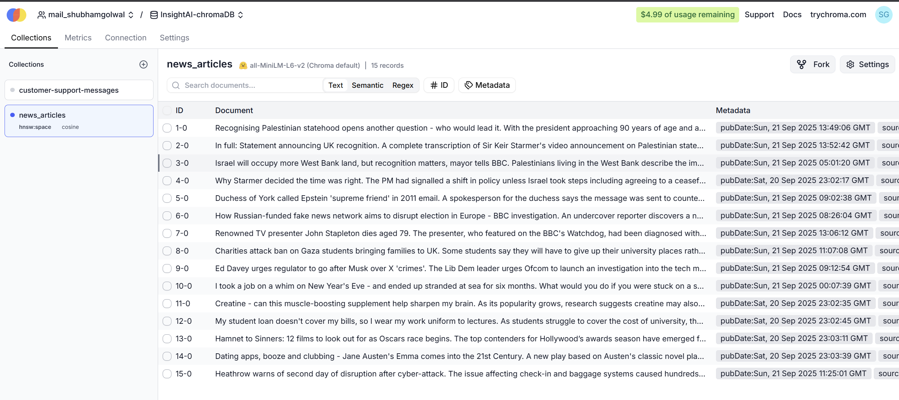
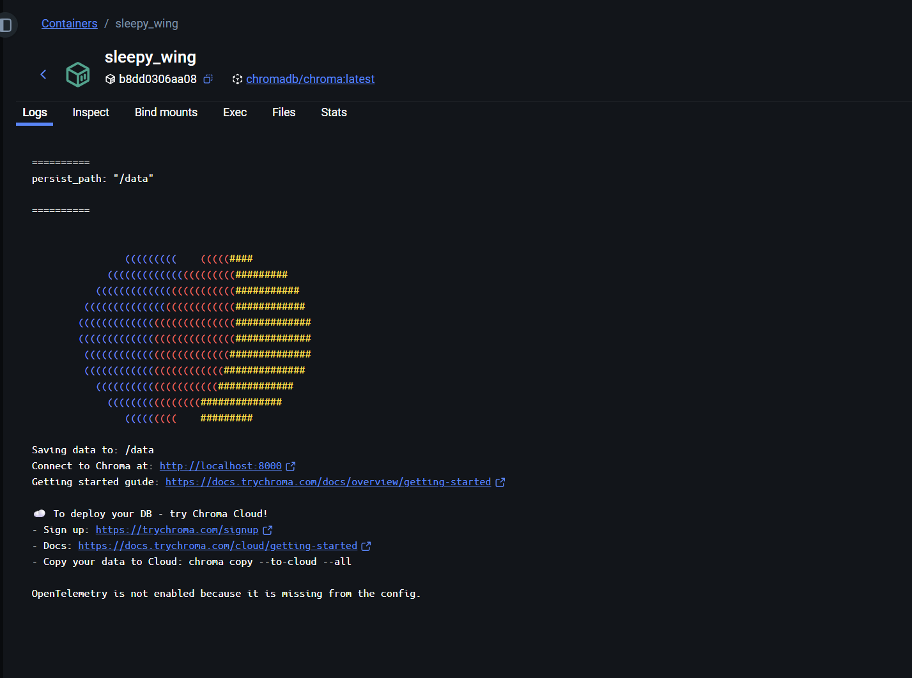
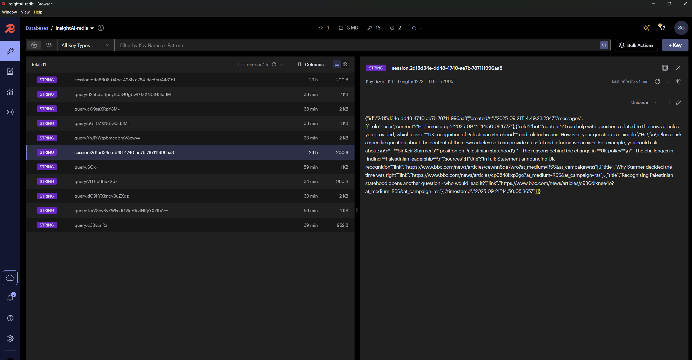
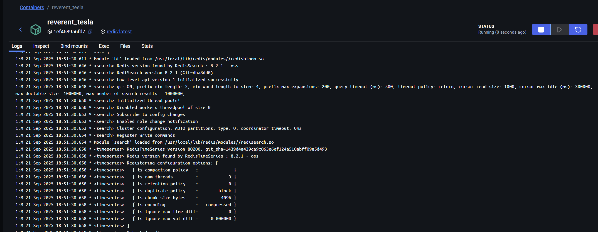
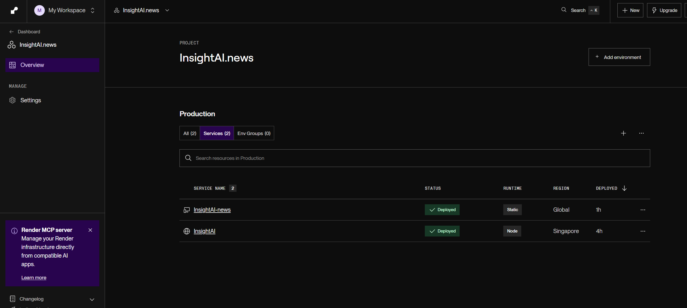
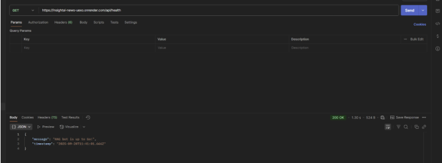

# InsightAI.news Backend

## Overview

The backend service for InsightAI.news - an intelligent news RAG system that provides smart answers to news-related queries with advanced caching and session management.

## Features

- 🔍 **RAG-Powered Chatbot**: Answer queries from live news sources using Retrieval-Augmented Generation
- 🚀 **Smart Caching**: Redis-based multi-layer caching with TTLs, auto-renewal, and warming for popular queries
- 💬 **Session Management**: Unique session IDs, persistent history, and one-click reset support
- 📊 **Cache Insights**: Real-time stats and analytics for monitoring performance
- 🌐 **Dynamic News Sources** _(Future via MCP)_: Users can inject any news page or feed and chat over it instantly

## Architecture

### Data Flow

```
RSS Feed → Parse Articles → Chunk Text → Embeddings → Vector Store
```

### System Architecture

```
Backend (Node.js/Express) ←→ Redis (Caching) ←→ ChromaDB (Vectors) ←→ Gemini AI
```

> **Note**: Currently using hardcoded credentials instead of .env injection due to deployment configuration. This will be fixed in future updates.

## Services & Infrastructure

### Vector Database - ChromaDB

**Production Environment:**

_ChromaDB client configuration for production deployment_

**Development Environment:**

_ChromaDB Docker image for local development_

### Caching Layer - Redis

**Production Environment:**

_Redis client configuration for production deployment_

**Development Environment:**

_Redis Docker image for local development_

## Cache Management System

### Cache Categories

1. **Session Cache** (`session:*`)

   - Stores user chat sessions and conversation history
   - Default TTL: 24 hours (86400 seconds)
   - Auto-renewed on activity

2. **Query Cache** (`query:*`)

   - Caches frequently asked questions and responses
   - Default TTL: 1 hour (3600 seconds)
   - Includes source references and metadata

3. **Vector Cache** (`vector:*`)
   - Stores processed vector embeddings
   - Default TTL: 6 hours (21600 seconds)
   - Reduces computation overhead

### TTL Configuration

Configure cache expiration times in the `.env` file:

```env
# Cache Configuration
SESSION_TTL=86400          # Session TTL in seconds (24 hours)
VECTOR_CACHE_TTL=21600     # Vector cache TTL in seconds (6 hours)
QUERY_CACHE_TTL=3600       # Query result cache TTL in seconds (1 hour)
```

### Cache Warming

Automatic cache warming pre-loads popular queries to improve response times:

```env
# Cache Warming Configuration
ENABLE_CACHE_WARMING=true                    # Enable/disable cache warming
CACHE_WARMING_INTERVAL=60                    # Warming interval in minutes
POPULAR_QUERIES=what is the latest news,today's news,breaking news,politics,sports
```

## Deployment & Achievements

### Production Deployment

🚀 **Successfully deployed on Render using Redis MCP**

_Backend service deployed and running on Render cloud platform_

### Backup & Recovery

💾 **First-time backend backup completed**

_Initial backup system implementation and verification_

### Key Achievements

- ✅ Production deployment on Render platform
- ✅ Automated backup system implementation
- ✅ Redis caching layer optimization
- ✅ ChromaDB vector storage integration
- ✅ Session management with persistence
- ✅ Real-time cache analytics and monitoring

## Installation & Setup

### Prerequisites

- Node.js 18+
- Redis Server
- ChromaDB Server

### Backend Setup

1. **Clone and install dependencies:**

```bash
cd Backend
npm install
```

2. **Configure environment variables:**

```bash
cp .env.example .env
# Edit .env with your configuration
```

3. **Start Redis server:**

```bash
redis-server
```

4. **Start ChromaDB server:**

```bash
docker run -p 8000:8000 chromadb/chroma
```

5. **Start the backend server:**

```bash
npm start
```

## Cache Management API

### Get Cache Statistics

```http
GET /api/cache/stats
```

Response:

```json
{
  "success": true,
  "stats": {
    "totalKeys": 156,
    "categories": {
      "sessions": 23,
      "queries": 45,
      "vectors": 88,
      "other": 0
    },
    "keysByTTL": {
      "expiring": 140,
      "persistent": 16
    },
    "memoryUsage": 2048576
  }
}
```

### Manual Cache Warming

```http
POST /api/cache/warm
```

### Clear Cache by Pattern

```http
DELETE /api/cache/clear/query:*
```

**Or clear all cache:**

```http
DELETE /api/cache/clear
```

### Session TTL Management

**Refresh session TTL:**

```http
PUT /api/session/{sessionId}/refresh
```

**Check session TTL:**

```http
GET /api/session/{sessionId}/ttl
```

Response:

```json
{
  "success": true,
  "sessionId": "abc-123",
  "ttl": 3600,
  "expiresIn": "60 minutes"
}
```

## Performance Optimization

### Cache Hit Strategies

1. **Popular Query Caching**: Frequently asked questions are pre-cached
2. **Session Persistence**: User conversations persist across browser sessions
3. **Vector Optimization**: Embeddings cached to avoid recomputation
4. **Intelligent Warming**: System learns and caches trending topics

### TTL Best Practices

**Short TTL (1-5 minutes):**

- Real-time data queries
- Breaking news updates
- Live event information

**Medium TTL (1-6 hours):**

- General news queries
- Analysis and summaries
- Topic-based searches

**Long TTL (12-24 hours):**

- User sessions
- Historical data
- Static content

### Cache Warming Strategies

1. **Time-based Warming**: Schedule warming during off-peak hours
2. **Usage-based Warming**: Cache queries based on frequency patterns
3. **Topic-based Warming**: Pre-cache content for trending topics
4. **Geographic Warming**: Cache region-specific content

## Monitoring & Debugging

### Cache Metrics

Monitor cache performance using the stats endpoint:

```javascript
// Example monitoring script
const monitorCache = async () => {
  const response = await fetch("/api/cache/stats");
  const { stats } = await response.json();

  console.log("Cache Hit Ratio:", stats.hitRatio);
  console.log("Memory Usage:", stats.memory);
  console.log("Key Distribution:", stats.categories);
};
```

## Configuration Examples

### Development Environment

```env
# Fast development cycles
SESSION_TTL=3600           # 1 hour
VECTOR_CACHE_TTL=1800      # 30 minutes
QUERY_CACHE_TTL=300        # 5 minutes
CACHE_WARMING_INTERVAL=15  # 15 minutes
```

## API Documentation

For complete API documentation, please refer to the Postman collection in the `/Postman-collection` directory.

## Contributing

Contributions are welcome! Please feel free to submit issues and pull requests.
