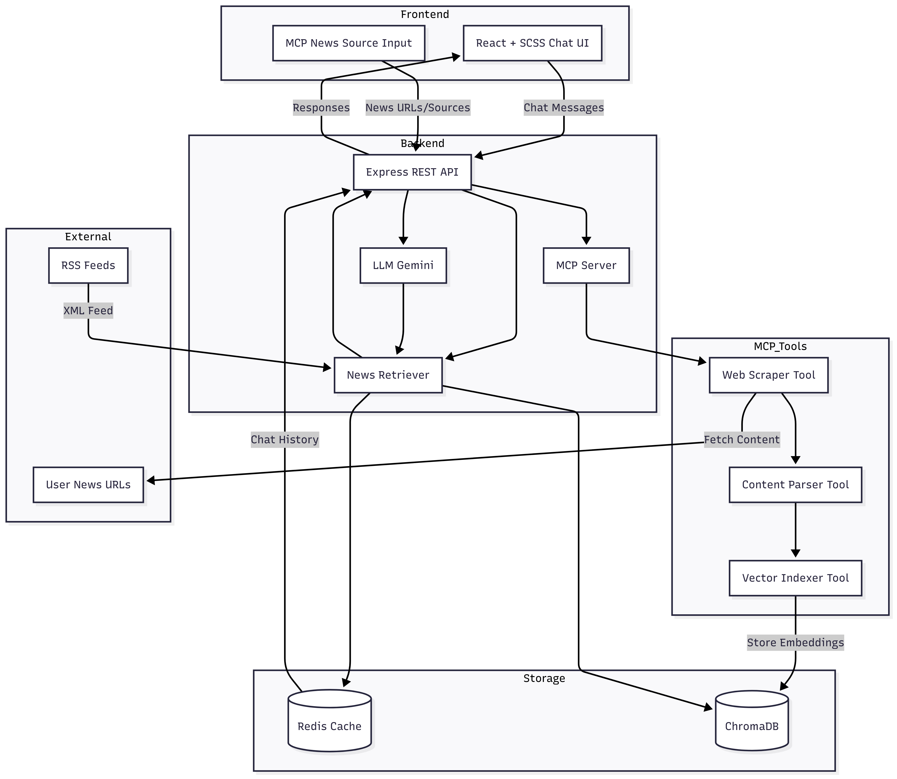

# InsightAI.news - Intelligent News RAG System

## Overview

InsightAI.news is a RAG (Retrieval-Augmented Generation) system that provides intelligent answers to news-related queries. The system features advanced caching, configurable TTL settings, and automatic cache warming for optimal performance.

## Features

- 🔍 **RAG-Powered Chatbot** – Answer queries from live news sources using Retrieval-Augmented Generation
- 🚀 **Smart Caching** – Redis-based multi-layer caching with TTLs, auto-renewal, and warming for popular queries
- 💬 **Session Management** – Unique session IDs, persistent history, and one-click reset support
- 📊 **Cache Insights** – Real-time stats and analytics for monitoring performance
- 🌐 **Dynamic News Sources (Future via MCP)** – Users can inject any news page or feed and chat over it instantly

### System Architecture


## Deployment Links

- **Frontend**: [insightai-news.onrender.com](https://insightai-news.onrender.com/) | [insight-ai-news.vercel.app](https://insight-ai-news.vercel.app/)
- **Backend**: [insightai-k8wq.onrender.com](https://insightai-k8wq.onrender.com)
- **Repository**: [github.com/Zedx07/InsightAI.news](https://github.com/Zedx07/InsightAI.news)

## Project Structure

```
InsightAI.news/
├── README.md                    # Main project documentation
├── docker-compose.yml          # Docker configuration
├── Backend/                     # Backend service
│   ├── README.md               # Backend-specific documentation
│   ├── server.js               # Main server file
│   ├── package.json            # Backend dependencies
│   └── services/               # Backend services
├── frontend/                    # Frontend React application
│   ├── README.md               # Frontend-specific documentation
│   ├── src/                    # Source code
│   └── package.json            # Frontend dependencies
└── Postman-collection/         # API testing collection
```

### Future Architecture



## Code Walkthrough

### Data Flow

```
RSS Feed → Parse Articles → Chunk Text → Generate Embeddings → Store in ChromaDB
User Query → Check Redis Cache → Retrieve Vectors → Generate AI Response → Cache Result
```

### End-to-End Flow

**1. Data Ingestion & Embedding Creation**

- `DataIngestionService` fetches 15 BBC RSS articles using Cheerio XML parser
- Articles are chunked into 500-character segments with sentence-based splitting
- `RAGPipeline` generates embeddings using ChromaDB's built-in embedding service
- Embeddings stored in CloudChroma with metadata (title, link, pubDate)

**2. Redis Caching Strategy**

- **Multi-layer caching**: Query results (1h TTL), Session data (24h TTL), Vector cache (6h TTL)
- **Auto cache warming**: Popular queries pre-cached every 60 minutes
- **Session management**: UUID-based sessions with persistent chat history
- **Smart TTL renewal**: Sessions refresh on activity, preventing data loss

**3. Frontend-Backend Communication**

- React frontend calls REST API endpoints (no WebSocket currently)
- `ApiService` handles all HTTP requests with error handling and fallbacks
- Session validation ensures data persistence across browser refreshes
- Real-time message updates via state management in `ChatInterface`

**4. RAG Query Processing**

- User query first checks Redis cache for existing responses
- If cache miss: ChromaDB performs cosine similarity search (top-3 chunks)
- Retrieved chunks contextualize Gemini 2.0 Flash for answer generation
- Response formatted in Markdown with source attribution
- Result cached for future identical queries

**5. Notable Design Decisions**

- **Cloud-first approach**: ChromaDB Cloud + Redis Cloud for production reliability
- **Sentence-based chunking**: Better context preservation than fixed-length splitting
- **Cache-first architecture**: Reduces API costs and improves response times
- **Session persistence**: Enables conversation continuity and user experience

**6. Potential Improvements**

- Implement WebSocket for real-time responses(Will add in Future)
- Add user authentication and personalized sessions
- Use Redis vector DB for storing cache in vectors
- Dynamic chunk sizing based on content type
- Implement vector similarity thresholds for relevance filtering
- Include MCP and create a Agentic RAG

## Documentation

- **Backend Documentation**: Please visit [Backend/README.md](./Backend/README.md) for detailed backend setup, API documentation, and cache management
- **Frontend Documentation**: See `frontend/README.md` for React app documentation
- **API Collection**: Import `Postman-collection/InsightAI.news-RAG.postman_collection.json` for API testing

## Technologies Used & Justification

- **Frontend**: React.js, SCSS - Component architecture ideal for chat interfaces with real-time updates
- **Backend**: Node.js, Express.js - Lightweight REST API with excellent async handling for vector search + LLM calls
- **Vector DB**: ChromaDB - Zero-config setup with built-in embeddings, perfect for rapid prototyping and MVP
- **Cache & Sessions**: Redis - Industry standard with sub-millisecond response times for chat history retrieval
- **AI**: Google Gemini 2.0 Flash - Generous free tier, fast responses, excellent instruction-following for RAG
- **Deployment**: Docker - Containerized deployment for production scalability

## Deployment

For production deployment, I deployed both backend and frontend using **Render MCP**. Created Docker images for containerized deployment of the complete monorepo (self-learning).

## Future Plans

- **Redis Vector Storage**: Implement Redis for storing vectors instead of ChromaDB
- **MCP Integration**: Implement personalized news sources using MCP integration. Currently processes ~50 fixed articles from RSS feeds. With MCP, users will paste any news link or select custom sources, and the chatbot will call an MCP scraper tool to pull and index content instantly, enabling chat over user-chosen sources

## Contributing

Just Fork and Clone and create a new Branch nad raise a PR. Let's build this together!

## License

MIT License - see LICENSE file for details

---

**Developed by** Shubham Golwal  
**Contact** shubhamgolwal123@gmail.com (+91 8767284228)
