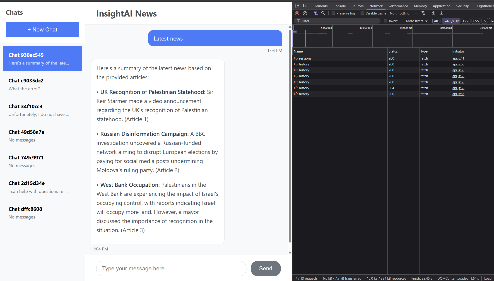

# InsightAI News - Frontend

## Overview

The frontend for InsightAI News is a React-based web application that provides an intelligent chat interface for news queries and analysis. Built with Create React App, it offers a seamless user experience for interacting with AI-powered news insights.

_InsightAI News chat interface showing session management and news analysis features_

## Features

- 🔍 **Intelligent Chat Interface**: Interactive chat for news queries and analysis
- 💬 **Session Management**: Persistent chat sessions with automatic saving
- 📱 **Responsive Design**: Optimized for desktop and mobile devices
- ⚡ **Real-time Updates**: Live chat responses with typing indicators
- 🎨 **Modern UI**: Clean, intuitive interface with SCSS styling
- 📊 **Chat History**: Access to previous conversations and sessions
- 🔄 **Auto-refresh**: Automatic session management and state persistence

## Application Interface

_InsightAI News chat interface showing session management and news analysis features_

The application features a modern, intuitive interface with:

### Chat Interface

- **Main Chat Window**: Central area for conversation display with latest news summaries
- **Message Input**: Text area for typing queries with send button
- **Session List**: Left sidebar showing all chat sessions with previews
- **New Chat Button**: Quick action to start fresh conversations

### Session Management

- **Automatic Session Creation**: New sessions created automatically with unique IDs
- **Session Persistence**: Conversations saved and retrievable across browser sessions
- **Session Previews**: Quick preview of conversation topics in the sidebar
- **Session Navigation**: Easy switching between different chat sessions

### Key Interface Elements

- **Clean Layout**: Organized two-panel design with session list and chat area
- **Real-time Responses**: Live display of AI-generated news summaries and analysis
- **Responsive Design**: Adapts to different screen sizes and devices
- **Developer Tools Integration**: Shows network activity and debugging information

## Getting Started with Create React App

This project was bootstrapped with [Create React App](https://github.com/facebook/create-react-app).

## Available Scripts

In the project directory, you can run:

### `npm start`

Runs the app in the development mode.\
Open [http://localhost:3000](http://localhost:3000) to view it in your browser.

The page will reload when you make changes.\
You may also see any lint errors in the console.

### `npm test`

Launches the test runner in the interactive watch mode.\
See the section about [running tests](https://facebook.github.io/create-react-app/docs/running-tests) for more information.

### `npm run build`

Builds the app for production to the `build` folder.\
It correctly bundles React in production mode and optimizes the build for the best performance.

The build is minified and the filenames include the hashes.\
Your app is ready to be deployed!

See the section about [deployment](https://facebook.github.io/create-react-app/docs/deployment) for more information.

### `npm run eject`

**Note: this is a one-way operation. Once you `eject`, you can't go back!**

If you aren't satisfied with the build tool and configuration choices, you can `eject` at any time. This command will remove the single build dependency from your project.

Instead, it will copy all the configuration files and the transitive dependencies (webpack, Babel, ESLint, etc) right into your project so you have full control over them. All of the commands except `eject` will still work, but they will point to the copied scripts so you can tweak them. At this point you're on your own.

You don't have to ever use `eject`. The curated feature set is suitable for small and middle deployments, and you shouldn't feel obligated to use this feature. However we understand that this tool wouldn't be useful if you couldn't customize it when you are ready for it.

## Learn More

You can learn more in the [Create React App documentation](https://facebook.github.io/create-react-app/docs/getting-started).

To learn React, check out the [React documentation](https://reactjs.org/).

### Code Splitting

This section has moved here: [https://facebook.github.io/create-react-app/docs/code-splitting](https://facebook.github.io/create-react-app/docs/code-splitting)

### Analyzing the Bundle Size

This section has moved here: [https://facebook.github.io/create-react-app/docs/analyzing-the-bundle-size](https://facebook.github.io/create-react-app/docs/analyzing-the-bundle-size)

### Making a Progressive Web App

This section has moved here: [https://facebook.github.io/create-react-app/docs/making-a-progressive-web-app](https://facebook.github.io/create-react-app/docs/making-a-progressive-web-app)

### Advanced Configuration

This section has moved here: [https://facebook.github.io/create-react-app/docs/advanced-configuration](https://facebook.github.io/create-react-app/docs/advanced-configuration)

### Deployment

This section has moved here: [https://facebook.github.io/create-react-app/docs/deployment](https://facebook.github.io/create-react-app/docs/deployment)

### `npm run build` fails to minify

This section has moved here: [https://facebook.github.io/create-react-app/docs/troubleshooting#npm-run-build-fails-to-minify](https://facebook.github.io/create-react-app/docs/troubleshooting#npm-run-build-fails-to-minify)
